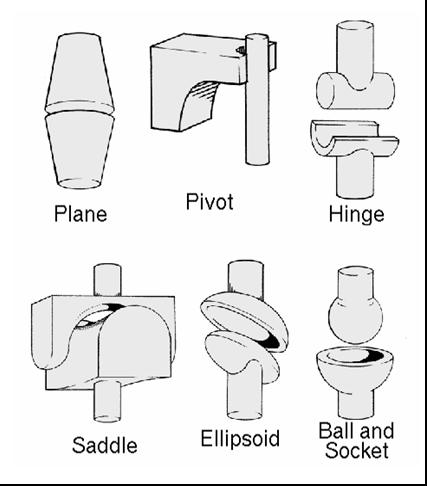
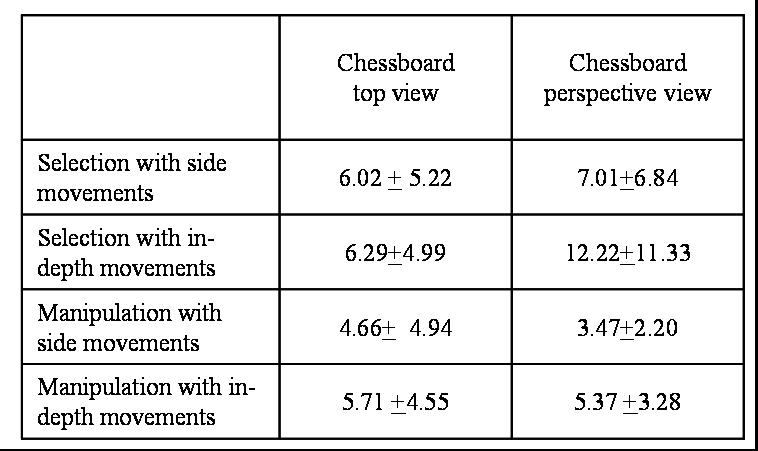

```{r setup, include=FALSE}
knitr::opts_chunk$set(fig.pos = "H", fig.align = "center")
```

# General Information

All full papers and posters (short papers) submitted to some SBC conference, including any supporting documents, should be written in English or in Portuguese. The format paper should be A4 with single column, 3.5 cm for upper margin, 2.5 cm for bottom margin and 3.0 cm for lateral margins, without headers or footers. The main font must be Times, 12 point nominal size, with 6 points of space before each paragraph. Page numbers must be suppressed.

Full papers must respect the page limits defined by the conference. Conferences that publish just abstracts ask for **one**-page texts.

# First Page

The first page must display the paper title, the name and address of the authors, the abstract in English and "resumo" in Portuguese ("resumos" are required only for papers written in Portuguese). The title must be centered over the whole page, in 16 point boldface font and with 12 points of space before itself. Author names must be centered in 12 point font, bold, all of them disposed in the same line, separated by commas and with 12 points of space after the title. Addresses must be centered in 12 point font, also with 12 points of space after the authors' names. E-mail addresses should be written using font Courier New, 10 point nominal size, with 6 points of space before and 6 points of space after.

The abstract and "resumo" (if is the case) must be in 12 point Times font, indented 0.8 cm on both sides. The word **Abstract** and **Resumo** should be written in boldface and must precede the text.

# CD-ROMs and Printed Proceedings

In some conferences, the papers are published on CD-ROM while only the abstract is published in the printed Proceedings. In this case, authors are invited to prepare two final versions of the paper. One, complete, to be published on the CD and the other, containing only the first page, with abstract and "resumo" (for papers in Portuguese).

# LaTeX

R Markdown and LaTeX can be written in the same document without any problem. This is useful when most of the text is easier to write in Markdown, but specific mathematical notation is better expressed directly in LaTeX.

For example, the discrete Fourier transform used in the Fast Fourier Transform can be written as:

$$
X_k = \sum_{n=0}^{N-1} x_n e^{-i 2\pi kn / N}, \quad k = 0, 1, \ldots, N-1.
$$

# Sections and Paragraphs

Section titles must be in boldface, 13 pt, flush left. There should be an extra 12 pt of space before each title. Section numbering is optional. The first paragraph of each section should not be indented, while the first lines of subsequent paragraphs should be indented by 1.27 cm.

## Subsections

The subsection titles must be in boldface, 12 pt, flush left.

# Figures and Captions

Figure and table captions should be centered if less than one line (Figure \ref{fig:fig1}), otherwise justified and indented by 0.8 cm on both margins, as shown in Figure \ref{fig:fig2}. The caption font must be Helvetica, 10 point, boldface, with 6 points of space before and after each caption.

```{r fig1, echo=FALSE, fig.pos='ht', out.width='50%', fig.cap='A typical figure'}

```

```{r fig2, echo=FALSE, fig.pos='ht', out.width='30%', fig.cap='This figure is an example of a figure caption taking more than one line and justified considering margins mentioned in Section 5.'}

```

In tables, try to avoid the use of colored or shaded backgrounds, and avoid thick, doubled, or unnecessary framing lines. When reporting empirical data, do not use more decimal digits than warranted by their precision and reproducibility. Table caption must be placed before the table (see Table \ref{fig:exTable1}) and the font used must also be Helvetica, 10 point, boldface, with 6 points of space before and after each caption.

```{r exTable1, echo=FALSE, fig.env='table', fig.pos='ht', out.width='70%', fig.cap='Variables to be considered on the evaluation of interaction techniques'}

```

# Graphs with R

The next example shows a figure generated directly by R during compilation.

```{r r-plot-example, echo=FALSE, fig.cap='Example of a figure generated directly by R during compilation.', fig.width=5, fig.height=3.5}
plot(
  pressure$temperature,
  pressure$pressure,
  type = "b",
  pch = 19,
  col = "black",
  xlab = "Temperature",
  ylab = "Pressure"
)
```

# Images

All images and illustrations should be in black-and-white, or gray tones, excepting for the papers that will be electronically available (on CD-ROMs, internet, etc.). The image resolution on paper should be about 600 dpi for black-and-white images, and 150-300 dpi for grayscale images. Do not include images with excessive resolution, as they may take hours to print, without any visible difference in the result.

# Tables with knitr

```{r markdown-table, echo=FALSE, results='asis'}
knitr::kable(
  data.frame(
    Technique = c("A", "B", "C"),
    Precision = c("High", "Medium", "Low"),
    Reproducibility = c("Medium", "High", "Medium")
  ),
  format = "latex",
  booktabs = TRUE,
  caption = "Example of a table written directly in Markdown."
)
```

# References

Bibliographic references must be unambiguous and uniform. We recommend giving the author names references in brackets, e.g. \cite{knuth:84}, \cite{boulic:91}; or dates in parentheses, e.g. Knuth (1984), Smith and Jones (1999).

The references must be listed using 12 point font size, with 6 points of space before each reference. The first line of each reference should not be indented, while the subsequent should be indented by 0.5 cm.

\nocite{dyer:95,holton:95,smith:99}
